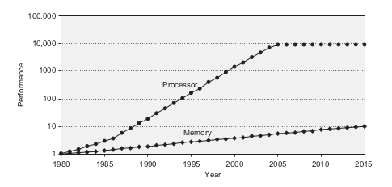
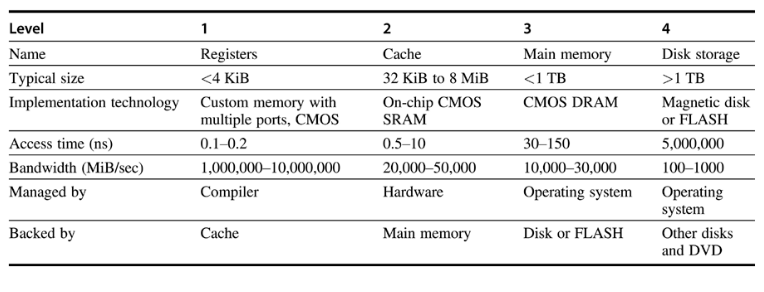

# Computer Architecture Exam 1 Study Guide (CDA4150/5155)

	*Information for this guide was sourced primarily from provided lecture slides, as well as from Hennessy and Patterson's Computer Architecture: A Quantitative Approach (6th Edition).*

# Table of Contents for Exam 1 Study Guide

- [Computer Architecture Exam 1 Study Guide (CDA4150/5155)](#computer-architecture-exam-1-study-guide-cda41505155)
- [Table of Contents for Exam 1 Study Guide](#table-of-contents-for-exam-1-study-guide)
  - [1. Memory-performance gaps](#1-memory-performance-gaps)
    - [Definition and Significance](#definition-and-significance)
    - [Causes and Implications](#causes-and-implications)
    - [Solutions and Strategies](#solutions-and-strategies)
  - [2. DRAM \& SRAM](#2-dram--sram)
    - [Definitions and Differences](#definitions-and-differences)
    - [Applications and Use-Cases](#applications-and-use-cases)
    - [2.a. Trade-Offs \& Concepts](#2a-trade-offs--concepts)
    - [2.b. Comparison Table](#2b-comparison-table)
  - [3. Memory Hierarchy](#3-memory-hierarchy)
    - [Definition and Importance](#definition-and-importance)
    - [Levels of Memory Hierarchy](#levels-of-memory-hierarchy)
    - [Access Time and Cost at Each Level](#access-time-and-cost-at-each-level)
  - [4. Cache](#4-cache)
    - [4.a. Why do we need a cache?](#4a-why-do-we-need-a-cache)
    - [4.b. What is cache?](#4b-what-is-cache)
    - [4.c. Structure](#4c-structure)
    - [4.d. How does it work?](#4d-how-does-it-work)
    - [4.e. Operations and definitions](#4e-operations-and-definitions)
    - [4.f. Comparisons of direct and associative cache](#4f-comparisons-of-direct-and-associative-cache)
    - [4.g. Write hit and miss replacement policies](#4g-write-hit-and-miss-replacement-policies)
    - [4.h. Performance with examples](#4h-performance-with-examples)
    - [4.i. Types of misses](#4i-types-of-misses)
    - [4.j. Multilevel caches (with examples)](#4j-multilevel-caches-with-examples)
    - [4.k. Optimization (prioritizing read miss vs. hit miss)](#4k-optimization-prioritizing-read-miss-vs-hit-miss)
    - [4.l. Why Cache Works: Locality](#4l-why-cache-works-locality)
  - [5. Locality](#5-locality)
    - [Types of Locality](#types-of-locality)
    - [Importance in Cache Design](#importance-in-cache-design)
    - [Challenges](#challenges)
  - [6. Hits and Misses](#6-hits-and-misses)
  - [7. Address \& Cache](#7-address--cache)
  - [8. Block size \& cache](#8-block-size--cache)
  - [9. Cache optimizations](#9-cache-optimizations)
  - [10. Software: matrix multiply with register use/reuse](#10-software-matrix-multiply-with-register-usereuse)
  - [11. Cache reuse, for matrix multiplication](#11-cache-reuse-for-matrix-multiplication)

## 1. Memory-performance gaps

The memory-performance gap, often referred to as the "memory wall", describes the growing disparity between the speed of CPU operations and the latency of memory access. As CPUs have continued to advance at a rapid pace, memory speeds have not kept up, leading to this widening gap. This section delves into the causes, implications, and potential solutions to this challenge.

### Definition and Significance

- **Memory-Performance Gap**: The difference in growth rates between CPU processing speeds and memory access times. While CPU speeds have been doubling approximately every 18 months (following Moore's Law), memory latency has seen only modest improvements.
  
- **Significance**: As CPUs become faster, they often have to wait for data to be fetched from memory. This waiting period, or "stall", can significantly hamper the overall system performance, even if the CPU itself is highly efficient.

### Causes and Implications
- **Causes**:
  - **Technological Limitations**: Physical constraints in DRAM technology that limit the rate of improvements.
  - **Economic Factors**: The high cost of developing faster memory technologies can deter rapid advancements.
  - **Power Consumption**: Faster memory often requires more power, leading to thermal challenges.

- **Implications**:
  - **Stalled CPU Cycles**: The CPU spends a significant amount of time waiting for data from memory, leading to underutilization of its capabilities.
  - **Energy Inefficiency**: Waiting for memory consumes power without doing useful work, leading to wasted energy.
  - **System Bottlenecks**: The overall system performance can be bottlenecked by memory latency, regardless of how fast the CPU is.

### Solutions and Strategies

- **Caching**: Using small amounts of faster memory (cache) to store frequently accessed data, reducing the need to fetch data from main memory.
  
- **Prefetching**: Predictively loading data into cache before it's needed by the CPU.
  
- **Memory-Level Parallelism**: Accessing memory in parallel to hide latency. This refers to the ability of a processor to issue multiple memory operations (like loads and stores) to different memory locations in parallel. Instead of waiting for one memory operation to complete before starting the next, MLP allows for several memory operations to be in progress at the same time, thereby hiding or reducing the perceived memory latency.
  
- **Improved DRAM Technologies**: Developing new memory technologies that can offer faster access times, such as DDR4, DDR5, and beyond.
  
- **Near Data Processing**: Moving computation closer to where data is stored, such as processing-in-memory (PIM) techniques.

By understanding and addressing the memory-performance gap, architects and developers can design systems that make the most of both CPU and memory capabilities, leading to more efficient and performant computing systems.

## 2. DRAM & SRAM

Dynamic Random Access Memory (DRAM) and Static Random Access Memory (SRAM) are two primary types of RAM used in computing systems. Each has its unique characteristics, advantages, and applications. This section provides an overview of both, highlighting their differences and use-cases.

### Definitions and Differences

- **DRAM (Dynamic Random Access Memory)**:
  - **Definition**: A type of volatile (non-persistent) memory that stores each bit of data in a separate capacitor within an integrated circuit.
  - **Characteristics**:
    - **Refresh Required**: The capacitors leak charge over time, so they need to be refreshed periodically.
    - **Slower Access Times**: Compared to SRAM, DRAM has slower access times.
    - **Lower Cost**: Generally cheaper to produce than SRAM.
    - **Higher Density**: Can store more data in the same amount of space compared to SRAM.

- **SRAM (Static Random Access Memory)**:
  - **Definition**: A type of volatile memory that uses bistable latching circuitry to store each bit.
  - **Characteristics**:
    - **No Refresh Required**: SRAM retains its data bits as long as power is supplied.
    - **Faster Access Times**: Offers quicker data access compared to DRAM.
    - **Higher Cost**: More expensive to produce due to its complexity.
    - **Lower Density**: Takes up more space for the same amount of data storage compared to DRAM.

### Applications and Use-Cases

- **DRAM**:
  - **Main Memory**: Often used as the primary memory in computing systems due to its cost-effectiveness and high storage capacity.
  - **Graphics RAM**: Used in graphics cards because of the need for large amounts of memory.

- **SRAM**:
  - **Cache Memory**: Due to its fast access times, SRAM is commonly used for CPU cache.
  - **On-Chip Memory**: Found on integrated circuits due to its speed.

### 2.a. Trade-Offs & Concepts

- **Speed vs. Power Consumption**: SRAM is faster but consumes more power, especially when idle. DRAM is slower but is more power-efficient during idle periods.
  
- **Cost vs. Capacity**: DRAM offers more storage capacity for a lower cost, while SRAM, being faster, is more expensive to produce.
  
- **Volatility**: Both DRAM and SRAM are volatile, meaning they lose their data when power is turned off. However, SRAM retains its data as long as power is supplied, while DRAM needs to be refreshed periodically even when powered on.

### 2.b. Comparison Table

| Feature/Characteristic | DRAM                                      | SRAM                                      |
|------------------------|-------------------------------------------|-------------------------------------------|
| **Definition**         | Volatile memory using capacitors.         | Volatile memory using bistable latching circuitry. |
| **Refresh Required**   | Yes, capacitors leak charge and need periodic refreshing. | No, retains data as long as power is supplied. |
| **Access Times**       | Slower                                    | Faster                                    |
| **Cost**               | Generally cheaper                         | More expensive due to complexity          |
| **Density**            | Higher (more data in same space)          | Lower (takes up more space for same data) |
| **Power Consumption**  | Consumes less power when idle.            | Consumes more power, especially when idle.|
| **Main Use Cases**     | Main memory, Graphics RAM                 | CPU cache, On-Chip Memory                 |

| **Feature**     | **Speed/Delay**      | **Cost/GB**         | **Capacity**       |
|-----------------|----------------------|---------------------|--------------------|
| **Static RAM**  | Fastest/0.5-2.5ns    | $1,000’s            | Smallest           |
| **Dynamic RAM** | Slow/50-70ns         | $10’s               | Large              |
| **Hard disks**  | Slowest/5-20ms       | $0.1’s              | Largest            |

Understanding the differences between DRAM and SRAM, as well as their respective trade-offs, is crucial when designing or working with computer systems. The choice between them often depends on the specific needs and constraints of the application at hand.

## 3. Memory Hierarchy

Memory hierarchy is a structured implementation of computer storage that uses multiple levels of memory to provide both high performance and cost-effective scalability. The idea behind the memory hierarchy is to bridge the gap between the processor speed and the slow memory speed by introducing faster, albeit smaller, memory types closer to the processor and larger, slower types further away.

### Definition and Importance

- **Memory Hierarchy**: A multi-level structure of different types of memory, organized based on speed and cost, with the goal of optimizing performance and cost.
  
- **Importance**: 
  - Balances the speed of CPUs and the latency of memory.
  - Provides an efficient way to manage and access data.
  - Reduces the average time to access memory.

### Levels of Memory Hierarchy

1. **Registers**: 
   - Located inside the CPU.
   - Fastest and most expensive type of memory.
   - Limited in size.

2. **Cache Memory (L1, L2, L3)**:
   - Located close to the CPU.
   - Faster than main memory but slower than registers.
   - Acts as a buffer between the CPU and main memory.

3. **Main Memory (RAM)**:
   - Where active processes reside.
   - Slower than cache but faster than secondary storage.
   - Volatile memory.

4. **Secondary Storage (Hard Disk, SSD)**:
   - Non-volatile storage.
   - Slower than RAM but offers larger capacity.
   - Stores data and programs not actively in use.

5. **Tertiary Storage (Optical disks, Magnetic tapes)**:
   - Used for archiving and backup.
   - Slowest and cheapest per bit.
   - Non-volatile.

### Access Time and Cost at Each Level

- As we move up the hierarchy (towards registers), access time decreases but cost per bit increases.
- As we move down the hierarchy (towards tertiary storage), access time increases but the memory becomes cheaper and offers more capacity.

Understanding the memory hierarchy is crucial for computer architects, programmers, and system designers. It plays a pivotal role in system performance, cost, and energy efficiency. By leveraging the strengths of each level, systems can achieve optimal performance while managing costs.

## 4. Cache

Cache memory, often simply referred to as "cache," is a high-speed volatile computer memory that provides high-speed data access to the processor and stores frequently used computer programs, applications, and data. Cache memory provides faster data storage and access by storing instances of programs and data routinely accessed by the processor.

### 4.a. Why do we need a cache?

- **Speed Up Memory Access**: Cache memory bridges the speed gap between the main memory and the CPU. By storing frequently accessed data, the CPU can avoid lengthy fetches from the slower main memory.
  
- **Reduce Memory-Performance Gap**: As discussed earlier, the disparity between memory speed and CPU speed can be mitigated with the use of cache memory.
  
- **Improve CPU Efficiency**: With faster access to data, the CPU spends less time waiting and more time processing, leading to better overall system performance.

### 4.b. What is cache?

- **Temporary Storage**: Cache is a smaller, faster type of memory that stores copies of frequently accessed data from main memory.
  
- **Types**: There are typically multiple levels of cache (L1, L2, L3) with L1 being the smallest and fastest, and L3 being the largest and slowest.

### 4.c. Structure

- **Cache Lines/Blocks**: The smallest unit of data that can be transferred between cache and main memory.
  
- **Tags**: Used to determine if a particular block of data is in the cache.
  
- **Index**: Determines the cache line where the data should be placed or retrieved.
  
- **Offset**: Specifies the exact location of the data within the cache line.

### 4.d. How does it work?

- **Cache Lookup Process**: When the CPU needs to access data, it first checks if the data is in the cache. If it's a "hit", the data is retrieved from cache. If it's a "miss", the data is fetched from main memory.
  
- **Cache Hit vs. Cache Miss**: A cache hit means the requested data is in the cache, while a cache miss means it isn't and must be fetched from main memory.

The subsequent subtopics delve deeper into the operations, definitions, comparisons, and intricacies of cache memory. Understanding cache is fundamental to grasping how modern computer systems achieve high performance.

### 4.e. Operations and definitions

- **Read Operation**: Fetching data from the cache. If the data isn't present (cache miss), it's fetched from main memory and also stored in the cache for future access.
  
- **Write Operation**: Updating data in the cache. Depending on the write policy, changes might also be updated to main memory immediately or after some time.

### 4.f. Comparisons of direct and associative cache

- **Direct-Mapped Cache**: Each block of main memory maps to a single cache line. Simple but can lead to higher miss rates.
  
- **Fully Associative Cache**: A block of main memory can be placed in any cache line. Flexible but requires more complex hardware.
  
- **N-Way Set Associative Cache**: A compromise between direct-mapped and fully associative. Blocks of main memory map to a set of cache lines, typically 2, 4, or 8.

### 4.g. Write hit and miss replacement policies

- **Write-Through**: Data is written to both the cache and main memory. Ensures consistency but can be slower.
  
- **Write-Back**: Data is written only to the cache. Main memory is updated only when the cache block is replaced. Faster but can lead to inconsistencies if not managed properly.

### 4.h. Performance with examples

- **Cache Hit Ratio**: The percentage of memory accesses that result in a cache hit. Higher is better.
  
- **Average Memory Access Time (AMAT)**: The average time taken to fetch data, considering both cache hits and misses.

### 4.i. Types of misses

- **Compulsory Miss**: The first access to a block will always result in a miss, as the data has never been in the cache.
  
- **Capacity Miss**: Occurs when the cache cannot contain all the blocks needed during program execution.
  
- **Conflict Miss**: Occurs in direct-mapped and set-associative caches when multiple blocks compete for the same cache line.

### 4.j. Multilevel caches (with examples)

- **L1, L2, L3 Caches**: Different levels of cache with varying sizes and speeds. L1 is smallest and fastest, directly connected to the CPU. L2 is larger and slower, and L3 is even larger and slower but can serve multiple cores.

### 4.k. Optimization (prioritizing read miss vs. hit miss)

- **Read Miss**: When the data being read isn't in the cache. Often prioritized as it can stall the CPU.
  
- **Write Miss**: When the data being written isn't in the cache. Depending on the write policy, this might not be as critical as a read miss.

### 4.l. Why Cache Works: Locality

Cache memory is effective due to the principle of **locality**. Locality is the tendency of a processor to access the same set of memory locations repetitively over a short period of time. There are two main types of locality:

- **Temporal Locality**: If an item is accessed, it's likely to be accessed again soon. This is why recently accessed data is stored in the cache.
  
- **Spatial Locality**: If an item is accessed, items whose addresses are close by are likely to be accessed soon. This is why blocks of data, rather than individual bytes, are fetched into the cache.

Understanding and leveraging locality allows computer systems to predictively manage and cache data, leading to significant performance improvements.

## 5. Locality

Locality is a key principle that underlies the effectiveness of cache memory in computer systems. It refers to the tendency of a processor to access a relatively small and specific set of memory locations in a short time span. By understanding and leveraging locality, computer systems can predictively manage and cache data, leading to significant performance improvements.

### Types of Locality

1. **Temporal Locality (Locality in Time)**:
   - **Definition**: If a memory location is accessed, it's likely to be accessed again in the near future.
   - **Implication**: Recent data should be kept in cache for quick access.
   - **Example**: Loop variables in a program.

2. **Spatial Locality (Locality in Space)**:
   - **Definition**: If a memory location is accessed, nearby memory locations (in terms of address space) are likely to be accessed soon.
   - **Implication**: When fetching data into cache, it's beneficial to also fetch adjacent data.
   - **Example**: Accessing elements of an array sequentially.

### Importance in Cache Design

- **Predictive Caching**: By understanding the patterns of data access (thanks to locality), cache controllers can predictively fetch and store data, improving cache hit rates.
  
- **Block Size Determination**: Spatial locality plays a role in determining the optimal cache block (or line) size. Larger blocks capture more spatial locality but might also bring in unnecessary data.
  
- **Prefetching**: Based on observed access patterns and spatial locality, systems can prefetch data into cache before it's explicitly requested by the CPU.

### Challenges

- **Cache Pollution**: Over-reliance on spatial locality can lead to cache pollution, where unnecessary data is brought into the cache, displacing potentially useful data.
  
- **Variable Access Patterns**: Not all programs or operations exhibit strong locality, making cache management more challenging.

Understanding locality is crucial for anyone working with or designing computer systems. It's a foundational concept that plays a pivotal role in system performance, especially in the context of memory hierarchy and cache design.

## 6. Hits and Misses
- Definitions and differences
- Impact on performance

## 7. Address & Cache
- Address translation
- Tag, index, and offset

## 8. Block size & cache
- Definition and significance
- Impact on cache performance

## 9. Cache optimizations
- Prefetching
  - Advantages: Reduces cache miss rate
  - Disadvantages: Can lead to unnecessary data fetch
- Cache bypassing
  - Advantages: Avoids polluting cache with non-reusable data
  - Disadvantages: Can miss potential cache hits
- Victim cache
  - Advantages: Stores blocks evicted from primary cache
  - Disadvantages: Additional hardware complexity

## 10. Software: matrix multiply with register use/reuse
- Definition and significance
- Analysis of register use and reuse

## 11. Cache reuse, for matrix multiplication
- Different matrix multiplication orders: kij, jik, etc.
- Impact on cache performance and reuse
